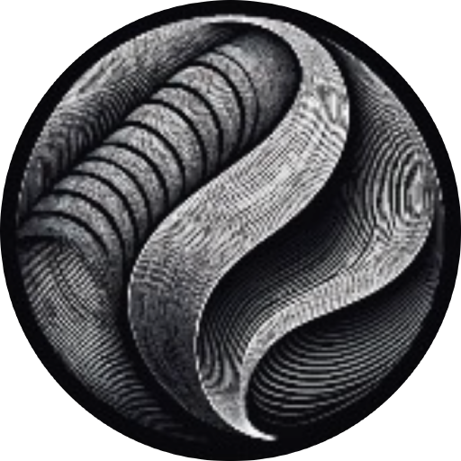

# Textile Designer AI for Claude



Run the [Textile Designer AI](https://www.textile-designer.ai) design tools from Claude on the image files on your computer: print-ready upscaling, seamless repeats (block, half brick, half drop), Super Scaler, background and watermark removal, Dress to Design (extract the print from a garment photo), Colourways, Colour and Object Layering, Channeling (screen separation into a multichannel PSD), Vectorizer, 3D and Embroidery effects, Sketch to Design, Design Generation, Spec Board and more.

Results are saved as files next to your input image, and Claude shows you a preview, the file paths and the credits used.

## What you need

- A Textile Designer AI account with credits or a plan: [sign up](https://www.textile-designer.ai).
- Node.js 18 or newer (the plugin starts the server with `npx`).

## Install

**Claude directory:** search for Textile Designer AI and install it.

**Claude Code, from this repository:**

```
/plugin marketplace add ScientiaAI/textile-designer-ai-claude
/plugin install textile-designer-ai@textile-designer-ai
```

**Any MCP client without the plugin** (Claude Desktop config, Codex, Cursor, VS Code): run `npx -y @textile-designer-ai/mcp`. Setup snippets for each client are in the [package README](https://www.npmjs.com/package/@textile-designer-ai/mcp).

## Using it

Ask Claude in plain words, for example:

- "Connect to Textile Designer AI."
- "Make a half-drop repeat of C:\designs\paisley.png at 300 dpi."
- "What would Dress to Design cost on dress.jpg with 2 outputs?"
- "Upscale floral.png 4x, then separate it into 8 screens."

When a tool has modes or settings you have not chosen, Claude asks you, one question at a time, with the recommended option preselected. Nothing is uploaded or charged until you answer, and prices are shown only when you ask.

Ask Claude things like "which tool should I use for a screen print?" or "how is Ready to Print different from Super Scaler?": it answers from the built-in Textile Designer AI guide.

## What this plugin runs and sends

- It runs the MIT-licensed MCP server [`@textile-designer-ai/mcp`](https://www.npmjs.com/package/@textile-designer-ai/mcp) on your computer, pinned to an exact version.
- It sends only the images you ask it to process, and the settings for that run, to `https://www.textile-designer.ai`, and downloads the results from Textile Designer AI's storage. It sends nothing else and runs nothing in the background.
- Your login is a device-code sign-in in your browser. The session token is stored in `~/.textile-designer/mcp-session.json`, readable only by you, and is never shown in chat.
- It also reads the list of image files in the input image's folder, only to count them for an optional one-time Image Search tip.

## Links

- Privacy policy: https://www.textile-designer.ai/privacy
- Terms: https://www.textile-designer.ai/terms
- Support: https://www.textile-designer.ai/contact

## License

MIT, Copyright (c) 2026 Scientia AI Private Limited.
